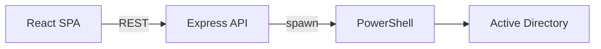

# AD Report Hub

**NPM package:** `ad-identity-tool`

AD Report Hub is a web application for read-only reporting and analysis across Active Directory forests with multiple domains. The solution consists of a React client, a Node.js Express API, and PowerShell scripts that use the Active Directory module to query directory data.

This document describes repository layout, deployment prerequisites, and configuration. Operational definitions for individual reports are maintained in the application **Help** section.

## 1. Scope and capabilities

Reporting is organized into three domains:

| Domain | Capabilities |
|--------|----------------|
| Identity | Users, groups, computers, contacts, and service accounts: search, detail views, structured reports, data export. |
| Infrastructure | Domain controllers, sites and subnets, site links, Group Policy objects, organizational units, and forest topology. |
| Governance and security | Compliance-oriented reports (privileged access, group membership changes, delegation, SID history, AdminSDHolder-related analysis) and security-focused summaries. |

Additional functions include global search, a dashboard, user preferences (favorites), navigation aids, and export to CSV, Microsoft Excel, JSON, or print-oriented output.

## 2. System architecture



| Layer | Technology | Notes |
|-------|------------|--------|
| Client | React 18 | Served via Create React App in development; static assets from `build/` in production. |
| API | Express | Default listen port `5000` (`PORT` environment variable). |
| Directory access | Windows PowerShell 5.1+ | Requires RSAT Active Directory module on the host running the API process. |

During development, the client development server proxies requests to `/api` to `http://localhost:5000` per `package.json`. In production, set `NODE_ENV=production` so Express serves the built client and continues to expose `/api` endpoints (`server/index.js`).

## 3. Functional map

### 3.1 Identity and access management

| Capability | REST prefix | Script location |
|------------|-------------|-----------------|
| Users | `/api/users` | `server/scripts/users/` |
| Groups | `/api/groups` | `server/scripts/groups/` |
| Computers | `/api/computers` | `server/scripts/computers/` |
| Contacts | `/api/contacts` | `server/scripts/contacts/` |
| Service accounts | `/api/service-accounts` | `server/scripts/service-accounts/` |

### 3.2 Infrastructure and directory topology

| Capability | REST prefix | Script location |
|------------|-------------|-----------------|
| Domain controllers | `/api/domain-controllers` | `server/scripts/domain-controllers/` |
| Sites, subnets, site links | `/api/sites-subnets` | `server/scripts/sites-subnets/` |
| Group Policy | `/api/gpos` | `server/scripts/gpos/` |
| Organizational units / containers | `/api/containers` | `server/scripts/containers/` |
| Forest topology | `/api/topology` | `server/scripts/topology/` |

### 3.3 Governance, compliance, and security

| Capability | REST prefix | Script location |
|------------|-------------|-----------------|
| Compliance reports | `/api/compliance` | `server/scripts/compliance/` |
| Security reports | `/api/security` | `server/scripts/security/` |
| Global search | `/api/search` | `server/scripts/` (search-related scripts) |

### 3.4 Platform services

| Capability | REST prefix | Implementation |
|------------|-------------|----------------|
| Dashboard | `/api/dashboard` | Aggregated metrics |
| Activity logging | `/api/activity-logs` | `server/middleware/activityLogger.js`, `server/utils/database.js` |
| Process context | `/api/system` | Environment and identity of the server process |

## 4. Prerequisites

| Requirement | Detail |
|-------------|--------|
| Node.js | Version 18 LTS or later recommended. |
| Operating system | Windows client or Windows Server; PowerShell must execute with directory connectivity to domain controllers. |
| Active Directory module | RSAT (or equivalent) so `Import-Module ActiveDirectory` succeeds under the account that runs the Node.js process. |
| Directory permissions | Read access to objects and attributes queried by selected reports. Some compliance features require replication metadata and/or read access to Security event logs on domain controllers; assign according to organizational policy and least privilege. |
| Network | DNS resolution, LDAP, and RPC to target domains; event log access where Security log-based reports are used. |

PowerShell sessions are launched in the security context of the Windows user that runs the Node.js process unless the deployment is customized.

## 5. Installation and execution

### 5.1 Install dependencies

```bash
npm install
```

### 5.2 Development

Runs the React development server (typically port 3000) and the API (port 5000) concurrently:

```bash
npm start
```

Verify API availability:

```http
GET http://localhost:5000/api/health
```

### 5.3 Production

Build the client, set the runtime environment, and start the API process (Windows `cmd` example):

```bash
npm run build
set NODE_ENV=production
set PORT=5000
node server/index.js
```

Production hosting on Windows is required for native Active Directory PowerShell module usage. Use `export` instead of `set` on POSIX shells only if you run a supported Windows deployment pattern.

## 6. Configuration

### 6.1 Domain and forest metadata

File: `server/config/domains.json`

This file drives the domain selector in the user interface and forest-scoped logic (for example, privileged group naming conventions per forest).

| Field | Description |
|-------|-------------|
| `name` | DNS name of the domain used as the connection anchor. |
| `forest` | Logical forest identifier for application rules. |
| `label` | Display label in the UI. |
| `requiresElevated` | Optional flag indicating that operators typically use an elevated-privilege account for this domain. |
| `description` | Optional human-readable description. |

### 6.2 Example structure (illustrative)

Replace placeholder values with approved tenant-specific names. Do not commit production-only configuration to public repositories if policy prohibits it.

```json
{
  "domains": [
    {
      "name": "corp.contoso.com",
      "forest": "Contoso",
      "label": "Contoso — Corp",
      "requiresElevated": false,
      "description": "Example production domain"
    }
  ]
}
```

Organizations may substitute a local override file (for example gitignored) if configuration must remain outside version control.

## 7. Repository structure

| Path | Responsibility |
|------|------------------|
| `src/` | React application entry (`App.js`) and feature components. |
| `server/index.js` | HTTP server bootstrap, route registration, production static file serving. |
| `server/routes/` | REST route handlers. |
| `server/scripts/` | PowerShell scripts, grouped by functional area. |
| `server/utils/powershell.js` | Script execution, stdout handling, JSON normalization. |
| `server/config/domains.json` | Domain and forest configuration. |
| `server/utils/database.js` | Persistence for activity logging. |

## 8. Security and operational guidance

- **Purpose:** The application supports read-oriented reporting. It does not replace change control, privileged access management systems, or native domain controller auditing.
- **Host placement:** Run the API on a managed administration host or bastion with restricted network paths to domain controllers.
- **Identity:** Prefer a dedicated service account whose rights are limited to the reports that are actually enabled.
- **Exposure:** Terminate TLS at a corporate reverse proxy or load balancer where applicable; restrict access with VPN, private networks, or single sign-on according to organizational standards.
- **Review:** Examine PowerShell scripts and API surface area before production approval.

## 9. Troubleshooting

| Observation | Recommended action |
|-------------|---------------------|
| Failure loading Active Directory module | Confirm RSAT installation and run `Import-Module ActiveDirectory` as the same user as the Node process. |
| Compliance output shows attribute changes without member detail | Validate replication metadata permissions, Security log read rights on relevant domain controllers, and report filter window; consult in-application Help. |
| JSON parsing errors in API responses | Inspect attribute values returned from directory for characters that break serialization; review `server/utils/powershell.js` handling. |
| Client cannot reach API during development | Confirm API listens on port 5000 and that `proxy` in `package.json` matches the API base URL. |
| Empty or broken UI after deployment | Run `npm run build`, ensure `build/` is present adjacent to `server/`, and set `NODE_ENV=production`. |

## 10. License and maintenance

This repository is intended for organizational use. Add a `LICENSE` file and contribution policy when distributing outside the owning organization; otherwise coordinate changes through your internal maintenance process.
